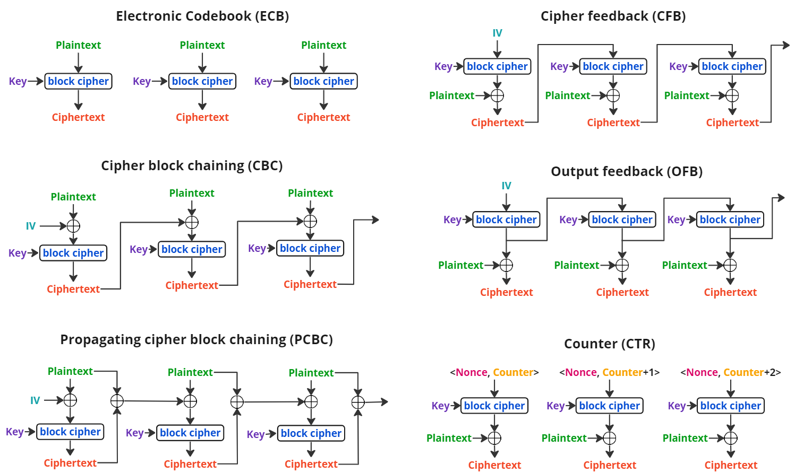
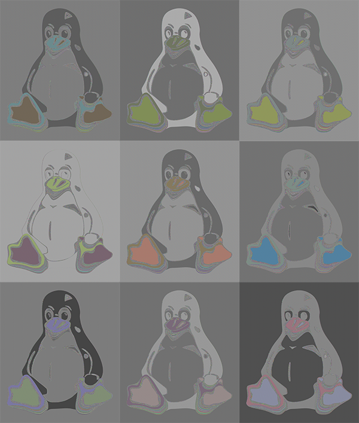
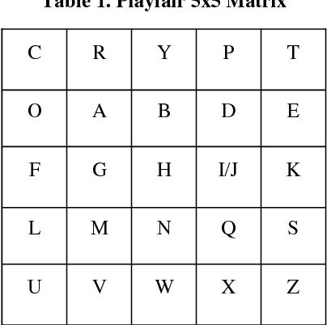

###Counter (CTR) Cipher

Hello, this is Spencer and Spencer back for another let's play

In class we learned about basic 
Here are some different versions of block chaining 

We decided to use the counter method, which includes a counter and a nonce and we made the counter a large prime number so the block key would be very different everytime.  In this cipher, each part of the text is xored with a different key to make it hard to find patterns and to stop repetition of encoding.

To create the block cipher we used the nonce and a key and tried a playfair cipher but with hex instead of letters. This way we would be able to xor the bytes rather than the letters.

This allows us to encode any type of document being text, images, and more.

An example of what could happen if the key doesn't change everytime is this ECB Linux Penguin

In this case, because the key was so short, it was repeated over and over and ended up encoding the image in a predicable manner. 

Different keys could cause different colors like this:

But either way this didn't do a good job of encoding the image.

When we use our encoder on an Image. We decided to encode everything, so the header and all of the markers within the image are also encoded.

That means that if someone was to intercept our image, they would be unable to even open the image getting numerous errors upon trying to open it. 

That means that even if the key is weak and with the counter and nonce, it's still obvious to crack, the hacker would be unable to clearly see what the image was supposed to be like with the linux penguin

One issue is that because the users would know what the headers are supposed to be, they could try to figure out how it was encoded. But as long as the key is long enough to contain the whole header, it won't be easy to figure out how it was encoded.

Implementation of Hex PlayFair:

We learned about typical playfairs, 5 by 5 grids with letters where one letter has to be excluded (typically i or j replace each other)

The plaintext would be broken into pairs and there were certain rules to generate the new pairs from the pairs of letters. 

What we did instead was to create pairs using a number from the key turned into integers and a nonce that would be changed throughout the encoding.

Then we had a 4 by 4 playfair that went from 0 to 15 and could be changed for further levels of encoding.

These would create a pair of numbers, so the key would always become twice as long when put through the playfair, making it more secure.

This means that the cipher is difficult to decode because you not only need to have the exact same playfair cipher configuration used but you also need to know what is done when the rows or columns are the same (how it is shifted), and even if that changes when the two numbers are the exact same.

