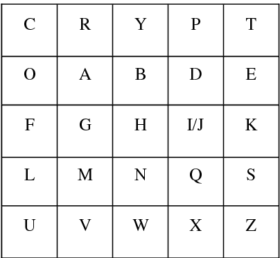

### Counter (CTR) Cipher

Hello, this is Spencer and Spencer back for another let's play

In class, we learned about basic encryption types and implemented an XOR stream cipher.

In our project, we implemented a block cipher, or the counter type block cipher to be more precise.

## Stream Ciphers

- Encrypt one bit of data at a time
- Are fast
- More resource-intensive
- Ideal for streaming services with video and voice encryption
- Can be prone to cascading where one mistake can lead to many more mistakes

## Block Ciphers

- Encode blocks of data rather than individual bits
- More often used on fixed data, like a book rather than something changing
- Some common examples used today are AES and 3DES

## Here are some different versions of block chaining

These ciphers have been around since 1981 with CTR being added in 2001.
We decided to use the counter method, which includes a counter and a nonce and we made the counter a large prime number so the block key would be very different every time.  In this cipher, each part of the text is XORed with a different key to make it hard to find patterns and to stop the repetition of encoding.

To create the block cipher we used the nonce and a key and tried a playfair cipher but with hex instead of letters. This way we would be able to XOR the bytes rather than the letters.

This would allow us to encode any type of document: text, images, and more.

An example of what could happen if the key doesn't change every time is this ECB (Electronic Code Book) Linux Penguin

In this case, because the chosen block length was short, the key was repeated over and over on similar data and ended up encoding the image in a predictable manner. 

Different keys could cause different colors like this:

But either way, this didn't do a good job of encoding the image.

We didn't implement the encoding for images, but it would be easy to adjust it, reading the bytes of the input file rather than the text.

### Implementation of Hex PlayFair:

We learned about typical play fair ciphers, 5 by 5 grids with letters where one letter has to be excluded (typically i or j replace each other)

## Review of Play Fair Rules:
- The plaintext would be broken into pairs
- Depending on where the pair of letters ended up on the 5 by 5 grid, a new pair would be chosen to replace the old pair.

For our implementation, instead of creating pairs from just the plaintext, the pair was created from a character from the key and a character from our counter. 

Each time we had a new block to encode, the counter would be incremented with a large prime number so that the generated key from the Playfair would be very different.

These would create a pair of numbers, so the key would always become twice as long as the given key when put through the Playfair, making it more secure, for the key would have to be reused fewer times.

Then we had a 4 by 4 Playfair that went from 0 to 15 and could be changed for further levels of encoding.

This means that the cipher is difficult to decode because you not only need to have the exact same Playfair cipher configuration used but you also need to know what is done when the rows or columns are the same (how it is shifted), and even if that changes when the two numbers are the exact same.

